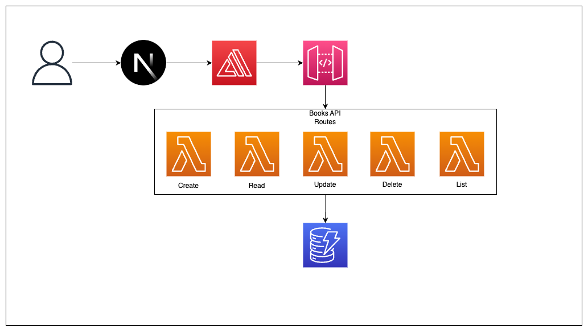

# Fullstack CRUD(L) API with NextJS and AWS CDK

This repo follows a YouTube series designed to teach developers how to create fullstack application using NextJS and the AWS CDK. This repo uses a `PetAPI` instead of a `BookAPI`, but all the concepts are exactly the same.
